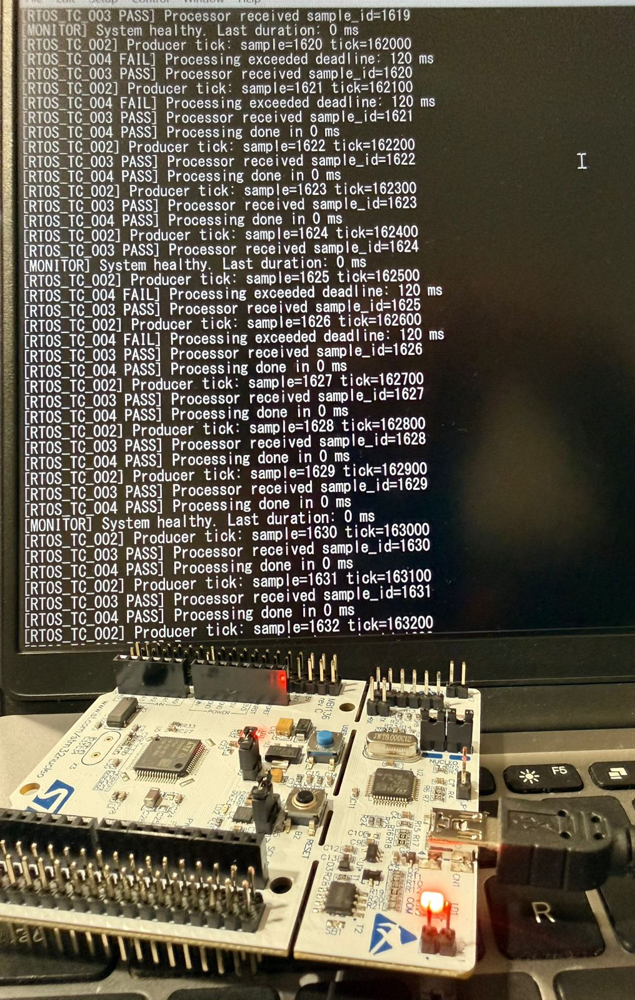
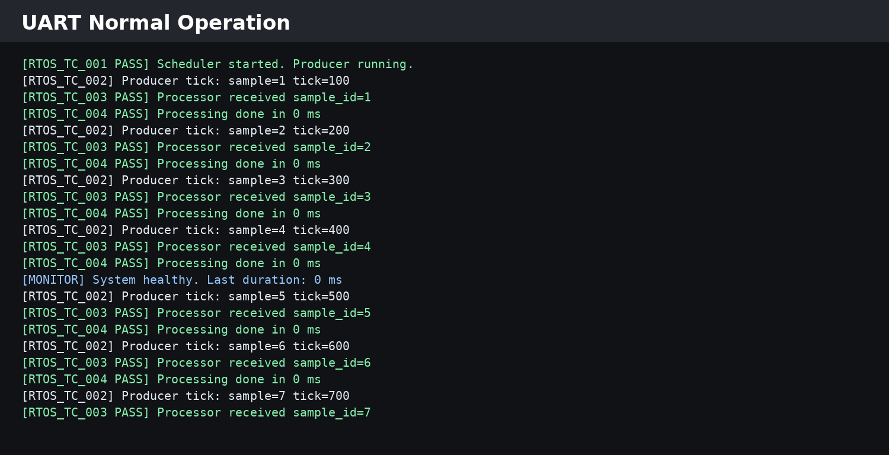
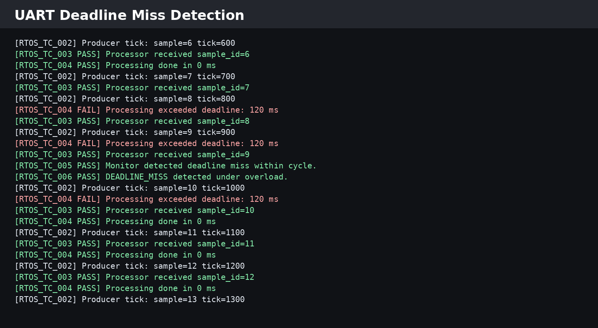
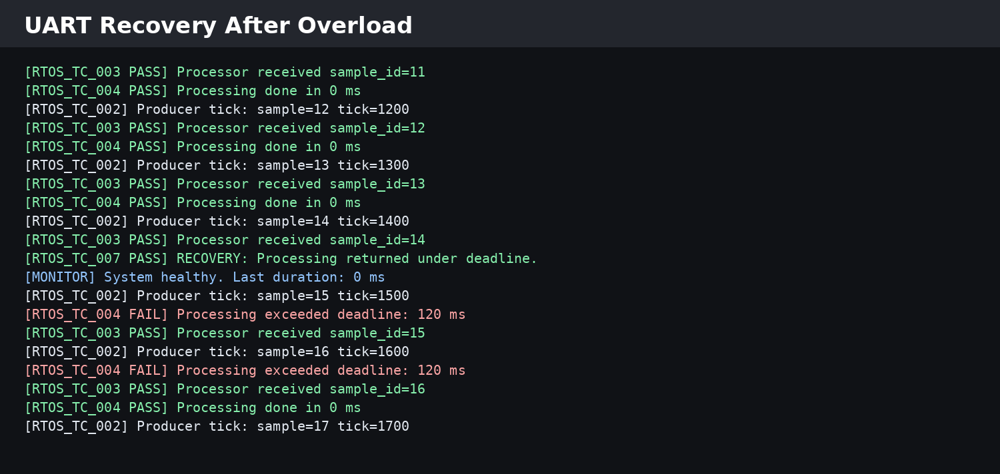
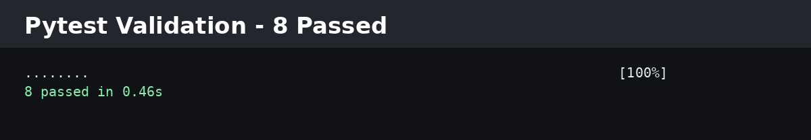
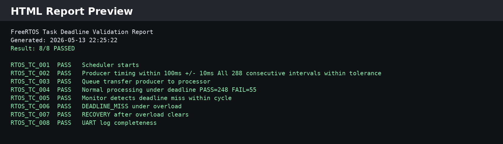

# FreeRTOS Task Deadline Validation System on STM32

Real-time deadline validation firmware for the STM32F401RE running FreeRTOS. A producer task generates queued sensor samples every 100 ms, a processor task consumes each sample under an 80 ms deadline, and a monitor task polls every 500 ms to detect deadline misses and log recovery. Overload is injected at runtime via the on-board user button (B1) to intentionally force deadline violations, proving the monitor detects and reports them. A Python HIL test suite parses the captured UART log and validates all 8 test cases automatically.

## Why 80 ms?

The processor deadline is 80 ms because the producer generates data every 100 ms. That leaves 20 ms of headroom for scheduling jitter, queue handling, logging, and system overhead before the next sample arrives.

## Key Features

- **Preemptive FreeRTOS scheduling** with 4 application tasks at distinct priorities
- **Producer task** — periodic at 100 ms via `vTaskDelayUntil`, sends sample IDs through a FreeRTOS queue
- **Processor task** — blocks on queue, measures its own execution duration against the 80 ms deadline
- **Monitor task** — polls shared timing struct every 500 ms, detects miss → recovery transitions
- **UART logger task** — decoupled log queue prevents UART blocking from distorting task timing
- **Overload injection** — user button (B1) EXTI toggles a 120 ms artificial delay in the processor
- **Stack overflow protection** — `configCHECK_FOR_STACK_OVERFLOW 2` with a hard-fault hook
- **Mutex-protected shared state** — processor timing struct accessed safely by processor and monitor
- **Python HIL automation** — serial capture, log parsing, pytest validation, and HTML/CSV/JSON report generation

## Locked Timing Constants

Defined in `Core/Inc/FreeRTOSConfig.h`:

```c
#define PROCESSOR_DEADLINE_MS    80
#define PRODUCER_PERIOD_MS       100
#define PRODUCER_TOLERANCE_MS    10
#define MONITOR_PERIOD_MS        500
```

## Task Architecture

| Task | Priority | Stack | Function |
|---|---|---|---|
| Monitor | 5 (highest) | 256 words | Polls `xProcessorTiming`, detects miss/recovery |
| Processor | 4 | 256 words | Consumes queue, measures duration, logs PASS/FAIL |
| Producer | 3 | 256 words | Periodic 100 ms sample generation via `vTaskDelayUntil` |
| UARTLogger | 1 | 256 words | Drains log queue to USART2 at 115200 baud |
| Default | Normal | 128 words | CubeMX idle task (required by CMSIS-RTOS) |

```text
                    ┌──────────────┐
                    │ Producer (3) │
                    │ 100 ms cycle │
                    └──────┬───────┘
                           │ xQueueSend
                           ▼
                    ┌──────────────┐
                    │  SensorQueue │  depth = 10
                    └──────┬───────┘
                           │ xQueueReceive (blocks)
                           ▼
                    ┌──────────────┐
                    │Processor (4) │──── measures duration
                    │  80 ms DL    │     writes xProcessorTiming
                    └──────┬───────┘     (mutex-protected)
                           │
              ┌────────────┴────────────┐
              ▼                         ▼
     ┌────────────────┐        ┌──────────────┐
     │ UART Logger (1)│        │ Monitor (5)  │
     │ log queue drain│        │ 500 ms poll  │
     └────────────────┘        └──────────────┘
```

## Firmware Modules

| File | Responsibility |
|---|---|
| `Core/Src/main.c` | HAL init, peripheral setup, queue/mutex creation, task creation, scheduler start |
| `Core/Src/rtos_tasks.c` | Producer task, Processor task, shared state definitions, B1 EXTI callback |
| `Core/Inc/rtos_tasks.h` | `ProcessorTiming_t` struct, queue/mutex externs, producer/processor prototypes |
| `Core/Src/deadline_monitor.c` | Monitor task — polls timing struct, logs miss/recovery transitions |
| `Core/Inc/deadline_monitor.h` | `vDeadlineMonitorTask` prototype |
| `Core/Src/uart_logger.c` | Log queue init, `UART_Log()` enqueue, logger task UART transmit |
| `Core/Inc/uart_logger.h` | Log queue extern, logger API prototypes |
| `Core/Src/freertos.c` | `vApplicationStackOverflowHook`, idle task memory (static allocation) |
| `Core/Inc/FreeRTOSConfig.h` | Kernel config, timing constants, stack overflow check level 2 |

## Stack Overflow Protection

`FreeRTOSConfig.h`:

```c
#define configCHECK_FOR_STACK_OVERFLOW 2
```

`freertos.c`:

```c
void vApplicationStackOverflowHook(TaskHandle_t xTask, char *pcTaskName)
{
    taskDISABLE_INTERRUPTS();
    while (1) {}
}
```

Level 2 checks both the stack pointer and a watermark pattern on every context switch. If a stack overflow is detected, interrupts are disabled and the system halts — preventing silent memory corruption.

## Python HIL Automation

```text
hil_tests/
├── serial_capture.py       # Capture UART log from STM32 COM port
├── live_uart_reader.py     # Alternate reader with argparse interface
├── live_log_validator.py   # Standalone log validator (no pytest dependency)
├── log_parser.py           # Core parser: extracts TC results and producer ticks
├── test_rtos.py            # pytest suite — 8 test cases
├── report_generator.py     # Generates HTML, CSV, and JSON reports
└── reports/
    ├── golden_uart_log.txt # Reference UART capture for regression testing
    ├── rtos_report.html    # Generated HTML report
    ├── rtos_results.csv    # Generated CSV results
    └── rtos_results.json   # Generated JSON results
```

## Validation Test Cases

| Test ID | Validation Goal | Result |
|---|---|---|
| RTOS_TC_001 | Scheduler starts and producer runs | PASS |
| RTOS_TC_002 | Producer timing remains within 100 ms ± 10 ms | PASS |
| RTOS_TC_003 | Queue transfer from producer to processor works | PASS |
| RTOS_TC_004 | Processor completes under deadline during normal operation | PASS |
| RTOS_TC_005 | Monitor detects deadline miss within cycle | PASS |
| RTOS_TC_006 | Deadline miss is detected under overload | PASS |
| RTOS_TC_007 | System recovers after overload clears | PASS |
| RTOS_TC_008 | UART log contains required validation fields | PASS |

## Running the HIL Validation

### 1. Capture UART output from the STM32 board

```bash
python hil_tests/serial_capture.py COM7 30
```

For macOS/Linux, replace `COM7` with the appropriate serial device:

```bash
python hil_tests/serial_capture.py /dev/tty.usbmodemXXXX 30
```

Alternatively, use the argparse-based reader:

```bash
python hil_tests/live_uart_reader.py --port COM7 --duration 30
```

### 2. Run the automated tests

Using the default log (`logs/rtos_uart_log.txt`):

```bash
pytest -q hil_tests/test_rtos.py
```

Using a specific log file:

```bash
# PowerShell
$env:RTOS_LOG_FILE="hil_tests/reports/golden_uart_log.txt"; pytest -q hil_tests/test_rtos.py

# Bash
RTOS_LOG_FILE=hil_tests/reports/golden_uart_log.txt pytest -q hil_tests/test_rtos.py
```

Expected result:

```text
........                                                                 [100%]
8 passed
```

### 3. Generate reports

```bash
RTOS_LOG_FILE=hil_tests/reports/golden_uart_log.txt python hil_tests/test_rtos.py
```

Generated outputs:

```text
hil_tests/reports/rtos_report.html
hil_tests/reports/rtos_results.csv
hil_tests/reports/rtos_results.json
```

### 4. Standalone validation (no pytest)

```bash
python hil_tests/live_log_validator.py --log logs/rtos_uart_log.txt
```

## Hardware Evidence

### STM32 Board Running Live UART Output



### UART Normal Operation — All Tasks PASS

Producer generates samples every 100 ms, processor completes under the 80 ms deadline, monitor reports system healthy.



### UART Deadline Miss Detection — Overload Injected

After pressing B1, the processor injects a 120 ms delay. TC_004 reports FAIL, and the monitor (TC_005, TC_006) detects the deadline miss.



### UART Recovery — Overload Cleared

After releasing B1, the processor returns under the 80 ms deadline. The monitor logs TC_007 RECOVERY.



### Pytest Validation — 8/8 Passed



### HTML Report — Full Test Summary



## FreeRTOS Kernel Configuration

| Parameter | Value |
|---|---|
| Tick rate | 1000 Hz (1 ms resolution) |
| Max priorities | 7 |
| Preemption | Enabled |
| Static allocation | Enabled |
| Dynamic allocation | Enabled |
| Total heap | 15360 bytes |
| Minimal stack | 128 words |
| Mutexes | Enabled |
| Stack overflow check | Level 2 |

## Build Toolchain

- **MCU**: STM32F401RETx (ARM Cortex-M4, 84 MHz)
- **IDE**: STM32CubeIDE
- **Compiler**: arm-none-eabi-gcc (GNU Arm Embedded Toolchain)
- **RTOS**: FreeRTOS v10.3.1 (via STM32Cube middleware)
- **UART**: USART2 at 115200 baud (ST-Link VCP)
- **Python**: 3.x with pyserial, pytest
